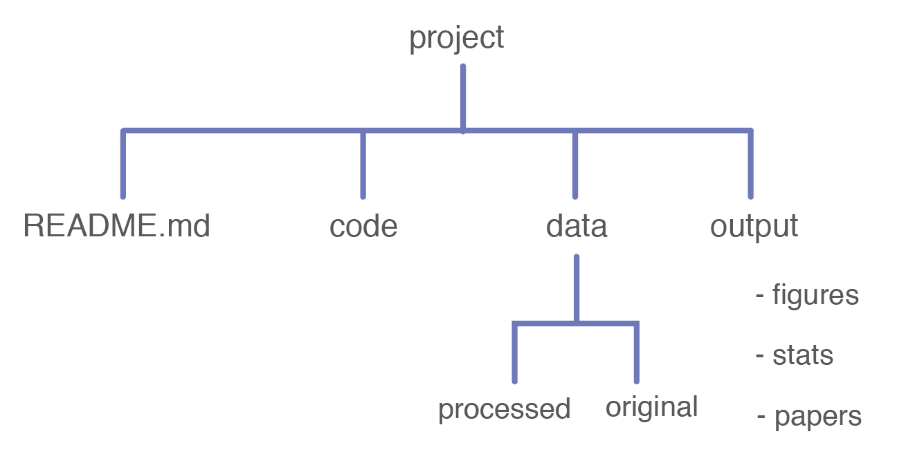

```{r setup, include=FALSE}
knitr::opts_chunk$set(echo = FALSE, fig.align="center")
```

<style>
  .note {
    font-size: 50%;
  }
  .references {
    font-size: 70%;
  }
</style>


## Slides Usage Notes 

- Recommended to press `w` for widescreen view.
- Also recommended to press `f` for fullscreen view.
- Press `p` for Presenter Notes.
- These slides are licensed as CC-BY.

## Introduction: A Bad Example

<center>

{width=80%}

</center>

::: {.notes}
Imagine that you have just started a new job and have to take over the work of a previous employee who has left the lab and gone off the grid. You receive a single Excel file of this person’s life work. Your boss has instructed you to:

1. Make sense of all the data they have collected
2. Write a report on the findings to share with others in the lab, so they may use the data and analyses in their own work.

With the goal of *making sense of the data*: What can you tell me about this data? And how do you know that?

- What is it?
- Where did it come from?
- When was it collected?
- Has anything been changed? If so, why was it changed?

Key Points

- Using disorganized data is time-consuming and error prone.
- Collaborators like your past self do not respond to email.

https://reproducible-science-curriculum.github.io/organization-RR-Jupyter/01-introduction/

:::

## We can do better!

1. Project file organization
2. README
3. Descriptive and “friendly” files names

::: {.notes}
A good project layout (aka file organization) helps ensure:

- The integrity of data, 
- The portability of the project, and
- Is easier to pick the project back up after a break (Credit: https://nicercode.github.io/blog/2013-04-05-projects/)

A README describes to users what the purpose of the project is.

Descriptive and friendly file names are lightweight metadata, and are essentially “self-documenting” practices.

The goal is to have a researcher who encounters your work to be readily able to recreate your final results, starting from the beginning with the same data file(s) with which you originally started. Yes, many funders, journals, and professional organizations will start to require better data management practices.  But I think the best motivation is, and I cannot emphasize this enough, that researcher encountering your work might be you in six months.  These practices are useful for meeting new requirements, but ultimately they will help you be a more efficient researcher. 
:::

# Project Organization

## Project Organization

<center>

{width=80%}

</center>

Image credit: https://reproducible-science-curriculum.github.io/

::: {.notes}
The first step in managing your data is to have a well organized project folder.  

Here is an example of a simple project structure. The “project” is a discrete research project, with its own code and data.  This image is mirroring how the files would be organized on your computer.

- The project level is the main “directory”, and all files live within this top-level folder. 
- Sub-folders are organized by “functional” content: code, data, and output. 
- A README file helps users understand more about the research project. 

Let’s walk through the directory structure...
:::

## `project` directory

- This is the top-level directory
- All files related to a project live in this one directory
- Give the project directory a meaningful name related to your research project

::: {.notes}
The top-level project directory is the foundational organization for your work.  Keep all of the materials associated with the project in one place. 

If you are working with a team, you will likely want to put this directory in a place where everyone has access to it, likely on a networked drive or cloud storage (following the appropriate security concerns for any sensitive data, of course).  Everyone on the team generally should have access to all associated materials (again, barring sensitivity issues.)  Networked drives and cloud storage also benefit from being pretty well backed up. 

Finally, clear names are helpful to everyone.
:::

## `code` sub-directory

- Separate code into its own directory.
- Other common names for this directory: 
  - Scripts
  - Source or src
  - Command_files
  - R
- Depending on the complexity of your project, you might want to separate:
  - Analysis code
  - Function definitions
- Treat as "must save."
  
::: {.notes}
This assumes that you are using scripts.  You should be using scripts for any changes or analysis that you make on your project.  Using GUIs to point and click or using Excel are not effective for logging what you did.  Command files are essentially self-documenting - they are a record of what you did. Command files are also better than typed lists and descriptions because creating typed lists and descriptions is time consuming and introduces the possibility of error, by not matching what you did with what you described.

Here is a good SPSS syntax tutorial: https://libguides.library.kent.edu/SPSS/Syntax 
:::

## `data` sub-directory

- You must identify which data files are:
  - Original (aka raw aka source) data
    - Treat as read-only!
  - Modified: either programmatically or manually edited
    - Treat as disposable. 
  
::: {.notes}
The original data files are files that you received or created, and did not modify in any way.  This represents the very start of your project.  Everything about the project can be traced back to this original dataset. Treat raw data as read-only - never overwrite your data.  You want to treat your raw data as read-only because having it means you can always recover from any data management or data analysis errors.  


Here are more suggestions for keeping your raw data safe: Using your operating system explorer, mark your raw data as read-only, so you cannot inadvertently change the file. Even better: put a backup copy somewhere else. UVA makes OneDrive and Box available to the academic side, but you need to pay close attention to the policies if you are working with sensitive data. *Show how to make read-only in Windows Explorer.*

Your modified data is the result of having worked on your dataset - maybe you standardized a variable or did some sort of data cleaning. If you made a mistake creating the standardized variable, you can always trash the modified dataset and start over with the raw data.

It is preferable to use scripts to make your modifications.  Scripts are not only more efficient than manual editing, they also are a log of the changes you made to the original data file. The scripts allow you to completely recreate your modified data.

A note about remote data files...if your files are too large to store locally or are necessarily remote (e.g., data is accessed through a live connection to a database), you might not have a raw-data directory.  You might have to rely on pointing to the data via an absolute path (like to a URL or a networked directory) in your script.  You will likely still store some sort of intermediate data.  Do whatever makes sense for your project!  If that’s necessary, make sure to include this info in a README.  But take care not to include paths or keys that should remain private (i.e., don’t include that information in a script that will be posted to a public GitHub repo.) 

If you are working with neuroimaging data, you may find Brain Imaging Data Structure, aka BIDS, a useful resource for organizing your data: https://bids.neuroimaging.io/
:::

## `output` sub-directory

- This sub-directory contains files generated from other files.
- Examples include:
  - Plots
  - Tables
- Treat as disposable.
  
::: {.notes}
Treat generated output as disposable.  Just like modified data, you can rely on your scripts to re-create any plots or tables. 
:::

## `documents` or `reports` sub-directory

- Lastly, you need a place for your documents or reports - basically any textual report that you might write in relation to the project. 
- Keep in mind these are outwardly facing files (for an advisor, academic readers, clients, etc.).  Keep this separate from your data and code, as those are internally facing work files.
- Treat as "must save."

## `documentation` sub-directory

- forms, questionnaires, stimuli, study protocols (instructions or scripts), ads and letters used for participant recruitment, etc.
- Treat as "must save."

::: {.notes}
The documentation sub-directory should reflect any useful documentation for the project. You should be able to share it with other researchers.  Nothing confidential should be stored here (i.e., no data or participant information).

Here is an example of a behavioral psychology curation standard: https://www.ncbi.nlm.nih.gov/pmc/articles/PMC7874086/ 
:::

## Key Points

- Distinguish between file types.
- Distinguish between "must save"/read-only vs disposable. 
- Record modifications.
- More art than science.

::: {.notes}
- Original files (raw data, scripts) and output files (modified data, tables and plots) should be clearly distinguished.
  - Keep raw data files raw - never edit original copies.
  - Treat output files as disposable.
- Keep a clear record of every modification that has been made to files.  Ideally, this is in the form of a script that could be used to automatically and completely regenerate cleaned data files from raw data.
- More art than science: Every project is different, and will require different organization strategies. Organize however makes sense for your collaborators and your future self.
:::

## Identify Output Files

<center>

{width=80%}
</center>

Image credit: https://reproducible-science-curriculum.github.io/

::: {.notes}
The processed data, figures, and stats should all be easily regenerated, as long as you have the original data and scripts.  Treat them as disposable.  (Except for the papers, of course.)
:::

## More Examples...

<center>

{width=80%}

</center>

Image credit: https://datacarpentry.org/r-socialsci/00-intro/index.html

::: {.notes}
In this example, "raw data" and "output data" are separate sub-directories.  "Documents" has its own sub-directory. 

Here is a Psychology-specific example (page 10) https://www.apa.org/pubs/books/Managing-Research-Data-Documentation-Series-Forward-and-Intro-Sample.pdf 

Credit: Data Carpentry: R for Social Scientists: Before We Start. https://datacarpentry.org/r-socialsci/00-intro/index.html
:::

## A more complex example

<center>

{width=80%}

</center>

Image credit: Ties de Kok: [How to keep your research projects organized, part 1: folder structure](https://towardsdatascience.com/how-to-keep-your-research-projects-organized-part-1-folder-structure-10bd56034d3a).

::: {.notes}
This example uses “pipeline” instead of output data.  Note the “tmp” (temporary), store, out sub-folders.

Credit Ties de Kok: [How to keep your research projects organized, part 1: folder structure](https://towardsdatascience.com/how-to-keep-your-research-projects-organized-part-1-folder-structure-10bd56034d3a).
:::

## Automate your folder structure

<center>

{width=60%}

</center>

::: {.notes}
Use scripts or clone a repository that only sets up a folder structure and otherwise has no other content. 

Here is an example: https://github.com/Reproducible-Science-Curriculum/rr-init  
:::

## Project Organization
- **Good**. Separate input and code from output using different folders and keep track of all the input->output changes in separate files. 
- **Better**. Consistent folder structure across projects. Read-only raw data
- **Best**. Script to generate folder structures, Version control READMEs and scripts to track modifications

::: {.notes}
“Some researchers create a separate project for each manuscript they are working on, while others group all research on a common theme, data set, or algorithm into a single project.

As a rule of thumb, divide work into projects based on the overlap in data and code files. If 2 research efforts share no data or code, they will probably be easiest to manage independently. If they share more than half of their data and code, they are probably best managed together, while if you are building tools that are used in several projects, the common code should probably be in a project of its own.” Wilson et al https://journals.plos.org/ploscompbiol/article?id=10.1371/journal.pcbi.1005510#sec009   
:::

## Build out a Project Structure with Explorer/Finder
...And then visit bit.ly/org4repro 

::: {.notes}
Now, let’s take a moment to build out a project structure using Explorer/Finder.

Pick a folder to start with, maybe Documents, it really doesn’t matter where. 

Create a new folder: organizeForRepro

Inside that make four more folders:

- data
- scripts
- output
- documentation

Open your ‘data’ folder, and create two more folders:
 - raw
 - processed

Ultimately, you can make the details of how you organize your own, but you should focus on organizing by function, with the key distinction being input (raw data, original scripts) and output (processed data, figures).

--

Also, visit: https://bit.ly/org4repro (points to https://github.com/Reproducible-Science-Curriculum/rr-init). 

Click on the big green CODE button, download the zipped version, and extract it.  You could set up something like this for your own project
:::

# README: just a little bit of documentation

## `README` file

- A README gives users important information about a project. 
- Should be in plain text format (either plain text/.txt or Markdown/.md)

Useful README file content:

1. Project name
2. Useful dates (date project began, date last updated)
3. Author names and contact info
4. Origin of data
5. 3-4 sentences about the goal of the project
6. Dependencies / How to Install / Project Structure

::: {.notes}
Every project needs a simple description of the project and its details. This is commonly done in a README file. 

Useful README content (see slide). 
Think about the spreadsheet we saw at the beginning of the workshop.  This information could have been useful for figuring out the background of that research project. 

The README goes in the top-level directory for the project. Depending on the complexity of the project, you might want to put in a README in the sub-directories as well, like for the data sub-directory. 

Self-documenting projects - another good practice is to simply use good, descriptive file names in files, directories, and code.  Realistically, you are more likely to do that than update the README.
:::

## Example README in Markdown

<center>

{width=80%}

</center>

::: {.notes}
Here is an example of what a simple README in Markdown format would look like.

README files formatted as plain text (or [markdown](https://guides.github.com/features/mastering-markdown/)) ([markdown cheat sheet](https://guides.github.com/pdfs/markdown-cheatsheet-online.pdf)) make it easily accessible by any computer. 

Markdown is a lightweight and easy-to-use syntax for styling all forms of writing on the GitHub platform. Markdown is mostly just regular plain-text with a few non-alphabetic characters thrown in, like # or * to format the content.  

Text editor recommendations: [Notepad++](http://notepad-plus-plus.org/) or
[BBEdit/TextWrangler](http://www.barebones.com/products/textwrangler/download.html), or 
[Sublime Text](https://www.sublimetext.com). 

Let’s open up our text editor and try it out: 

1. Project name
2. Useful dates (date project began, date last updated)
3. Author names and contact info
4. Origin of data
5. 3-4 sentences about the goal of the project
6. Dependencies / How to Install / Project Structure

Also visit this very detailed README template found via Cornell’s Research Data Services: https://bit.ly/cornellReadme // https://cornell.box.com/v/ReadmeTemplate 
:::

## README: Good, Better, Best
- **Good**. Plain text. 
- **Better**. Date, name, contact info, short summary, Markdown.
- **Best**. Include history of all changes to the project.

# Naming Files

## Names Matter
Three principles for files names:

- Human readable
- Machine readable
- Plays well with default ordering

::: {.notes}
Credit: Jenny Bryan https://speakerdeck.com/jennybc/how-to-name-files?slide=4 
:::

## Human readable
- Names indicate content
  - 01_data-cleaning.R
  - 02_visualization.R
- Vs.
  - 01.R
  - 02.R
- Easy to figure out based on the name

## Naming conventions: Use names to convey order

<center>

{width=60%}

</center>

::: {.notes}
Scripts are named with a two-digit prefix here.  This indicates to the user in which order you should run the files. Note that this implies that you scripts are modular -- better to break up your scripts into pieces than have one enormous script. 

This also takes advantage of the automatic sorting your computer does when you view files in Explorer or Finder. 
:::

## Naming conventions: Use names to convey history

<center>

{width=60%}

</center>

::: {.notes}
Use files naming to convey history. 

Tip: Use the ISO date standard: YYYY-MM-DD.  Other date conventions are confusing. This way also takes advantage of the automatic sorting your computer does when viewing files in Explorer/Finder. 


:::

## Machine readable
- Make it easy to search for files later
  - Via regex or through your operating system’s search functionality
- Avoid these in file names:
  - Spaces
  - Punctuation except `-` and `_`
  - Accented characters
- Do use:
  - A consistent capitalization scheme, i.e., don’t include the names foo and Foo in the same project
  - Separate units of metadata with `_` -- use it as a delimiter for regex
  - Use `-` within units of metadata for easier human readability 

::: {.notes}

Another guiding principle is to make the file names as consistent as possible. Note how hyphens, underscores, and spaces are used in the previous example - they are all very consistent, which makes working with files via scripts easier.

https://speakerdeck.com/jennybc/how-to-name-files?slide=10  
:::

## Example of advanced technique: “globbing”

<center>

{width=80%}

</center>

Image credit: Jenny Bryan: https://speakerdeck.com/jennybc/how-to-name-files?slide=7 

## Example of advanced technique: recover metadata

<center>

{width=80%}

</center>

Image credit: Jenny Bryan https://speakerdeck.com/jennybc/how-to-name-files?slide=10

## Plays well with default ordering

This means that when you look at project files in your directory, the files undergo default ordering in the display

- Put numeric info first
- For logical order: Left pad numbers with zeros
- For chronological order: Use date format: YYYY-MM-DD

## Default ordering: Left pad numbers with zeros

Like so: 

- 01_cleaning.R
- 02_visualization.R
- 10_final-figures.R

If you don’t, it could lead to this order:

- 10_final-figures.R
- 1_cleaning.R
- 2_visualization.R

## Default ordering: ISO 8601 date standard

Use YYYY-MM-DD.  Leads to far less confusion among humans.  Machines will always interpret this correctly.  Default ordering will work correctly every time. 

:::: {style="display: flex;"}

::: {}

Yes: 

{width=80%}

:::

::: {}

No:

{width=80%}

:::
::::

## File names: Good, Better, Best

- **Good**. Use descriptive file/directory names that convey function and history.
- **Better**. ISO 8601 date stamps in file and directory names.  Use numbers (with left-padding) to indicate order of scripts. 
- **Best**. Separate units of metadata with `_` (underscore) for regex. Within units of metadata, use `-` (hyphen or dash) for human readability. 

## Organization case study

<center>

{width=80%}

</center>

::: {.notes}
Putting it into practice.  Viewing the image:

- What features help you understand what the project is about?
- What features are useful for creating a reproducible pipeline?
- What features help you understand the relationship of the individual files to each other?
- What features do you find most useful to help organize your projects?

We didn’t talk much about version control, but this project can definitely benefit from that. That would be the next step in good research data management.
:::

## One more example, with named files

<center>

{width=80%}

</center>

Image credit: \@jessenleon

::: {.notes}
This is a nice example because the prefix of the scripts files matches the output in the results files.  Good example of self-documenting, because even if you inherited this project with very little in the way of documentation or narrative (like a README), you could still make sense of the entire project.
:::

## In sum, good project organization and file names...

- Are easy to implement now.
- Payoff the more complicated your projects get, and the better your skills become:
  - File names: if you do find yourself needing to use regex to call files
  - Project organization: reflects what you need to do anyway when compiling R packages
- Make your life easier!

## Psychology-specific Research Data Management resource
Managing Your Research Data and Documentation, by K. R. Berenson.  Available as an ebook from UVA Library. https://search.lib.virginia.edu/sources/uva_library/items/u9059599 

## Credits

Much of the Project Organization and README material has been adapted from: Reproducible Science Curriculum: Data & Project Organization: https://reproducible-science-curriculum.github.io/organization-RR-Jupyter/ 

Much of the file naming material has been adapted from: Jenny Bryan. How to Name Files. https://speakerdeck.com/jennybc/how-to-name-files 

## Further References
<font size="1">

Project TIER.  TIER Protocol 3.0.  https://www.projecttier.org/tier-protocol/specifications-3-0/ 

Data Carpentry.  R for Social Scientists: Before We Start. https://datacarpentry.org/r-socialsci/00-intro/index.html. 

Data Carpentry.  File Organization: https://datacarpentry.org/rr-organization1/.  

Data Carpentry.  Reproducible Research in R Workshop Overview. https://datacarpentry.org/rr-workshop/ 

Dryad. Best Practices for creating reusable data publications: Organize files in a logical schema. https://datadryad.org/stash/best_practices#organize 

Martin Chan. 2020.  "RStudio Projects and Working Directories: A Beginner's Guide."  Musings on R. https://martinctc.github.io/blog/rstudio-projects-and-working-directories-a-beginner's-guide/ 

Leon Jessen.  2018.  https://twitter.com/jessenleon/status/964236119658418176  and How to organize a project: The most important talk you never heard! https://github.com/leonjessen/talks 

Ties de Kok.  How to keep your research projects organized, part 1: folder structure. https://towardsdatascience.com/how-to-keep-your-research-projects-organized-part-1-folder-structure-10bd56034d3a 

Greg Wilson, et al. "Good enough practices in scientific computing." PLOS Computational Biology. 2017. https://journals.plos.org/ploscompbiol/article?id=10.1371/journal.pcbi.1005510#pcbi.1005510.ref001 

Noble, W. S. "A Quick Guide to Organizing Computational Biology Projects." PLOS Computational Biology. 2009. https://journals.plos.org/ploscompbiol/article?id=10.1371/journal.pcbi.1000424 

Jenny Bryan. How to name files. https://speakerdeck.com/jennybc/how-to-name-files 

Rich Fitzjohn.  Designing Projects. https://nicercode.github.io/blog/2013-04-05-projects/ 

Chris Von Csefalvay. Structuring R Projects. https://chrisvoncsefalvay.com/2018/08/09/structuring-r-projects/ (Note: best source for more complicated data science projects.)

Krista L. DeStasio. R Best Practices. https://kdestasio.github.io/post/r_best_practices/#fn1 

</font size>
